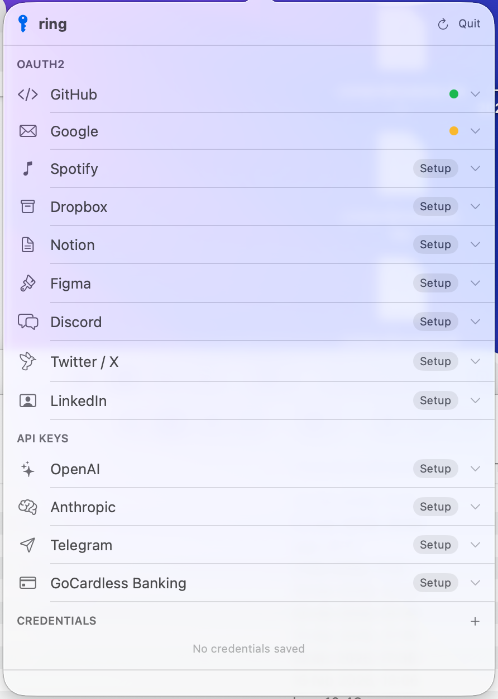
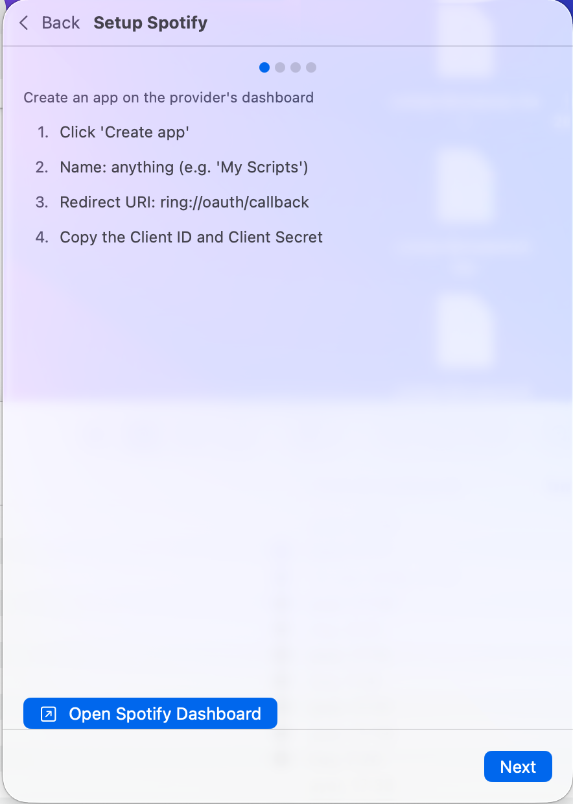

# ring

`ring` is a local OAuth and credentials manager for macOS.

It includes:
- A **CLI** for scripts and terminal workflows.
- A **menu bar app** for setup, scope management, and token operations.

Both use the same macOS Keychain service (`com.ring.tokenstore`).

## Screenshots

### Providers in the menu bar popover


### In-popover setup wizard


## Why ring

- Keep OAuth tokens, API keys, and credentials local.
- Reuse one secure store from UI and CLI.
- Quickly fetch valid access tokens from scripts.
- Manage OAuth scopes with re-authorization flows.

## Supported providers

OAuth2:
- GitHub
- Google
- Spotify
- Dropbox
- Notion
- Figma
- Discord
- Twitter / X
- LinkedIn

API key providers:
- OpenAI
- Anthropic
- Telegram
- GoCardless

## Repository layout

- `cli/` -> Go CLI (`ring` command)
- `ring-app/` -> SwiftUI macOS menu bar app
- `DOCS/` -> design and architecture notes

## Quick start

### 1) Build the CLI

```bash
cd cli
go build -o dist/ring ./cmd
./dist/ring --help
```

### 2) Build and run the macOS app

```bash
cd ring-app
xcodegen generate
xcodebuild -scheme Ring -configuration Debug \
  -derivedDataPath /tmp/ring-derived \
  build
open /tmp/ring-derived/Build/Products/Debug/Ring.app
```

### 3) Install to a stable app path (recommended for fewer Keychain prompts)

```bash
cd ring-app
make install-app
# if needed:
# sudo make install-app
```

## CLI usage examples

Configure a provider:

```bash
ring setup google
```

Authenticate:

```bash
ring login google
```

Get a valid token (for scripts):

```bash
TOKEN=$(ring token google)
```

Check all providers:

```bash
ring list
```

Show provider details:

```bash
ring status google
```

Manage scopes:

```bash
ring scopes google
ring scopes google --add https://www.googleapis.com/auth/gmail.readonly
```

## Menu bar app flow

1. Open `ring` from the menu bar icon.
2. Pick a provider and run setup/login inside the popover.
3. Manage scopes in the same popover view.
4. Use CLI (`ring token <provider>`) from scripts.

## Notes

- This project is currently macOS-focused.
- Keychain data is local to your user profile.
- For OAuth providers, make sure callback URLs match the setup wizard instructions.

## License

Add your license file (for example, MIT) and update this section.
